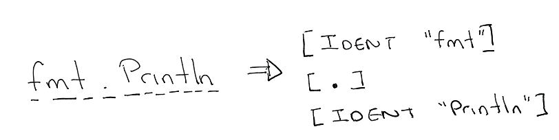

> Link: https://medium.com/justforfunc/whats-the-most-common-identifier-in-go-s-stdlib-e468f3c9c7d9

# Scanner
## What is scanner 
    a program that given a sequence of characters that generates a sequence of tokens

scanner don't care if this is a function call

## main.go在做什么
1. Scanner生成token
2. map 记录每个token 出现的次数
3. 把 map 转为 slice，进行排序

## 如何跑起来
1. go build -o scanner
2. scanner [文件名] (例如：scanner main.go)